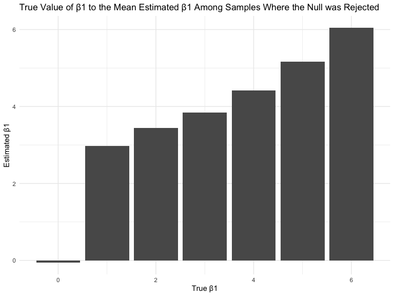

Homework 5
================
Troy Layouni

## Problem 1

-----

**Loading in `iris` dataset with missing values**

``` r
set.seed(10)

iris_with_missing = iris %>% 
  map_df(~replace(.x, sample(1:150, 20), NA)) %>%
  mutate(Species = as.character(Species))
```

#### Writing a function to replace missing values

  - missing numeric values are filled in with the mean of non-missing
    values
  - missing character values are filled in with \`“virginica”

<!-- end list -->

``` r
fix_missing = function(x) {
  if (is.numeric(x)) {
    replace_na(x, mean(x, na.rm = TRUE))
  } else if (is.character(x)) {
  replace_na(x, "virginica")
  }
}

iris_no_missing = map_dfr(iris_with_missing, fix_missing)
```

## Problem 2

-----

#### Part 1: Loading and tidying control and experimental arm data\*\*

  - reading in all files from each subject into one dataframe
  - tidying data to include 4 columns with study arm, id, week and

<!-- end list -->

``` r
read_files = function(file) {
  study_data = read_csv(file)
}

path_base = "./data/"

study_data = 
  tibble(
    file_name = list.files(path = "./data/"),
    all_files = str_c(path_base, file_name)) %>% 
  mutate(study_data = map(all_files, read_files)) %>% 
  unnest() %>% 
  select(-all_files) %>% 
  separate(file_name, into = c("study_arm", "subject_id"), sep = "\\_") %>% 
  pivot_longer(
    week_1:week_8, 
    names_to = "week", 
    values_to = "observation"
    ) %>% 
  mutate(
    subject_id = str_replace(subject_id, ".csv", ""),
    week = str_replace(week, "week_", ""),
    study_arm = str_replace(study_arm, "con", "control"),
    study_arm = str_replace(study_arm, "exp", "experimental")
)
```

    ## Parsed with column specification:
    ## cols(
    ##   week_1 = col_double(),
    ##   week_2 = col_double(),
    ##   week_3 = col_double(),
    ##   week_4 = col_double(),
    ##   week_5 = col_double(),
    ##   week_6 = col_double(),
    ##   week_7 = col_double(),
    ##   week_8 = col_double()
    ## )
    ## Parsed with column specification:
    ## cols(
    ##   week_1 = col_double(),
    ##   week_2 = col_double(),
    ##   week_3 = col_double(),
    ##   week_4 = col_double(),
    ##   week_5 = col_double(),
    ##   week_6 = col_double(),
    ##   week_7 = col_double(),
    ##   week_8 = col_double()
    ## )
    ## Parsed with column specification:
    ## cols(
    ##   week_1 = col_double(),
    ##   week_2 = col_double(),
    ##   week_3 = col_double(),
    ##   week_4 = col_double(),
    ##   week_5 = col_double(),
    ##   week_6 = col_double(),
    ##   week_7 = col_double(),
    ##   week_8 = col_double()
    ## )
    ## Parsed with column specification:
    ## cols(
    ##   week_1 = col_double(),
    ##   week_2 = col_double(),
    ##   week_3 = col_double(),
    ##   week_4 = col_double(),
    ##   week_5 = col_double(),
    ##   week_6 = col_double(),
    ##   week_7 = col_double(),
    ##   week_8 = col_double()
    ## )
    ## Parsed with column specification:
    ## cols(
    ##   week_1 = col_double(),
    ##   week_2 = col_double(),
    ##   week_3 = col_double(),
    ##   week_4 = col_double(),
    ##   week_5 = col_double(),
    ##   week_6 = col_double(),
    ##   week_7 = col_double(),
    ##   week_8 = col_double()
    ## )
    ## Parsed with column specification:
    ## cols(
    ##   week_1 = col_double(),
    ##   week_2 = col_double(),
    ##   week_3 = col_double(),
    ##   week_4 = col_double(),
    ##   week_5 = col_double(),
    ##   week_6 = col_double(),
    ##   week_7 = col_double(),
    ##   week_8 = col_double()
    ## )
    ## Parsed with column specification:
    ## cols(
    ##   week_1 = col_double(),
    ##   week_2 = col_double(),
    ##   week_3 = col_double(),
    ##   week_4 = col_double(),
    ##   week_5 = col_double(),
    ##   week_6 = col_double(),
    ##   week_7 = col_double(),
    ##   week_8 = col_double()
    ## )
    ## Parsed with column specification:
    ## cols(
    ##   week_1 = col_double(),
    ##   week_2 = col_double(),
    ##   week_3 = col_double(),
    ##   week_4 = col_double(),
    ##   week_5 = col_double(),
    ##   week_6 = col_double(),
    ##   week_7 = col_double(),
    ##   week_8 = col_double()
    ## )
    ## Parsed with column specification:
    ## cols(
    ##   week_1 = col_double(),
    ##   week_2 = col_double(),
    ##   week_3 = col_double(),
    ##   week_4 = col_double(),
    ##   week_5 = col_double(),
    ##   week_6 = col_double(),
    ##   week_7 = col_double(),
    ##   week_8 = col_double()
    ## )
    ## Parsed with column specification:
    ## cols(
    ##   week_1 = col_double(),
    ##   week_2 = col_double(),
    ##   week_3 = col_double(),
    ##   week_4 = col_double(),
    ##   week_5 = col_double(),
    ##   week_6 = col_double(),
    ##   week_7 = col_double(),
    ##   week_8 = col_double()
    ## )
    ## Parsed with column specification:
    ## cols(
    ##   week_1 = col_double(),
    ##   week_2 = col_double(),
    ##   week_3 = col_double(),
    ##   week_4 = col_double(),
    ##   week_5 = col_double(),
    ##   week_6 = col_double(),
    ##   week_7 = col_double(),
    ##   week_8 = col_double()
    ## )
    ## Parsed with column specification:
    ## cols(
    ##   week_1 = col_double(),
    ##   week_2 = col_double(),
    ##   week_3 = col_double(),
    ##   week_4 = col_double(),
    ##   week_5 = col_double(),
    ##   week_6 = col_double(),
    ##   week_7 = col_double(),
    ##   week_8 = col_double()
    ## )
    ## Parsed with column specification:
    ## cols(
    ##   week_1 = col_double(),
    ##   week_2 = col_double(),
    ##   week_3 = col_double(),
    ##   week_4 = col_double(),
    ##   week_5 = col_double(),
    ##   week_6 = col_double(),
    ##   week_7 = col_double(),
    ##   week_8 = col_double()
    ## )
    ## Parsed with column specification:
    ## cols(
    ##   week_1 = col_double(),
    ##   week_2 = col_double(),
    ##   week_3 = col_double(),
    ##   week_4 = col_double(),
    ##   week_5 = col_double(),
    ##   week_6 = col_double(),
    ##   week_7 = col_double(),
    ##   week_8 = col_double()
    ## )
    ## Parsed with column specification:
    ## cols(
    ##   week_1 = col_double(),
    ##   week_2 = col_double(),
    ##   week_3 = col_double(),
    ##   week_4 = col_double(),
    ##   week_5 = col_double(),
    ##   week_6 = col_double(),
    ##   week_7 = col_double(),
    ##   week_8 = col_double()
    ## )
    ## Parsed with column specification:
    ## cols(
    ##   week_1 = col_double(),
    ##   week_2 = col_double(),
    ##   week_3 = col_double(),
    ##   week_4 = col_double(),
    ##   week_5 = col_double(),
    ##   week_6 = col_double(),
    ##   week_7 = col_double(),
    ##   week_8 = col_double()
    ## )
    ## Parsed with column specification:
    ## cols(
    ##   week_1 = col_double(),
    ##   week_2 = col_double(),
    ##   week_3 = col_double(),
    ##   week_4 = col_double(),
    ##   week_5 = col_double(),
    ##   week_6 = col_double(),
    ##   week_7 = col_double(),
    ##   week_8 = col_double()
    ## )
    ## Parsed with column specification:
    ## cols(
    ##   week_1 = col_double(),
    ##   week_2 = col_double(),
    ##   week_3 = col_double(),
    ##   week_4 = col_double(),
    ##   week_5 = col_double(),
    ##   week_6 = col_double(),
    ##   week_7 = col_double(),
    ##   week_8 = col_double()
    ## )
    ## Parsed with column specification:
    ## cols(
    ##   week_1 = col_double(),
    ##   week_2 = col_double(),
    ##   week_3 = col_double(),
    ##   week_4 = col_double(),
    ##   week_5 = col_double(),
    ##   week_6 = col_double(),
    ##   week_7 = col_double(),
    ##   week_8 = col_double()
    ## )
    ## Parsed with column specification:
    ## cols(
    ##   week_1 = col_double(),
    ##   week_2 = col_double(),
    ##   week_3 = col_double(),
    ##   week_4 = col_double(),
    ##   week_5 = col_double(),
    ##   week_6 = col_double(),
    ##   week_7 = col_double(),
    ##   week_8 = col_double()
    ## )

#### Part 2: Making a spaghetti plot showing observations over time and differences between study arms

``` r
study_data %>% 
  group_by(study_arm, subject_id) %>% 
  
  ggplot(aes(x = week, y = observation, color = study_arm, group = interaction(study_arm, subject_id))) +
  #geom_point() + 
  geom_line() +
    labs(
   title = "Subject Observations Over Time",
   x = "Week",
   y = "Observation"
  ) 
```


Looking at the spaghetti plot where yellow represents the experimental
arm and purple represents the control arm, we see that the values of
weekly observations for the experimental subjects is higher on average
than that of the control arm. There appears to be a positive trend in
observation value and increasing week of observation among the
experimental subjects. At the end of the observed time, all participants
in the experimental arm have higher observation values than all of the
controls.

## Problem 3

-----

#### Part 1: Setting up a function for a simple linear regression

  - creating linear model with a β0 of 2, a variance of 50
  - using `broom::tidy` to clean the linear model output and keep only
    the estimate for β1 and the p-value

<!-- end list -->

``` r
set.seed(1)

sim_regression = function(n = 30, beta0 = 2, beta1 = 0) {
   
  sim_data = tibble(
    x = rnorm(n, mean = 0, sd = 1),
    y = beta0 + beta1 * x + rnorm(n, 0, 50^0.5)
  )
  
  ls_fit = lm(y  ~ x, data = sim_data)
  
  ls_fit %>% 
    broom::tidy() %>% 
    filter(term == "x") %>%
    select(estimate, p.value)
  
}
```

#### Part 2: Running a simulation 10000 times for varying values of β1

``` r
sim_results = 
  tibble(beta1 = c(0, 1, 2, 3, 4, 5, 6)) %>% 
  mutate(
    output_lists = map(.x = beta1, ~rerun(1000, sim_regression(beta1 = .x))),
    estimate_dfs = map(output_lists, bind_rows)) %>%
  select(-output_lists) %>% 
  unnest(estimate_dfs)
```

#### Part 3: Plotting the proportion of times the null was rejected (power) and the true value of β1.

``` r
sim_results %>% 
  group_by(beta1) %>% 
  mutate(
    p_rejected = mean(p.value < 0.05)
  ) %>% 
  distinct(beta1, p_rejected) %>% 
  
  ggplot(aes(x = beta1, y = p_rejected)) +
  geom_col() +
  labs(
    title = "Comparing Effect Size to Power",
   x = "Effect Size (β1)",
   y = "Power"
  ) 
```


Looking at the plot above, we see that as effect size or β1 increases,
power, or probability of correctly rejecting the null hypothesis also
increases.

#### Part 4: Plotting

Make a plot showing the average estimate of β̂ 1 on the y axis and the
true value of β1 on the x axis. Make a second plot (or overlay on the
first) the average estimate of β̂ 1 only in samples for which the null
was rejected on the y axis and the true value of β1 on the x axis. Is
the sample average of β̂ 1 across tests for which the null is rejected
approximately equal to the true value of β1? Why or why not?

``` r
sim_results %>% 
  group_by(beta1) %>% 
  mutate(
    mean_beta1_hat = mean(estimate)
  ) %>% 
  distinct(beta1, mean_beta1_hat) %>% 
  
  ggplot(aes(x = beta1, y = mean_beta1_hat)) +
  geom_col() +
  labs(
    title = "Comparing the True Value of β1 to the Mean Estimated β1",
    x = "True β1",
    y = "Estimated β1"
  )
```


``` r
sim_results %>% 
  filter(p.value < 0.05) %>%   group_by(beta1) %>% 
  mutate(
    mean_beta1_hat_reject = mean(estimate)
  ) %>% 
  distinct(beta1, mean_beta1_hat_reject) %>%
 
  ggplot(aes(x = beta1, y = mean_beta1_hat_reject)) +
  geom_col() +
  labs(
    title = "Comparing the True Value of β1 to the Mean Estimated β1 Among Those Samples Where the Null was Rejected",
    x = "True β1",
    y = "Estimated β1"
  ) 
```


